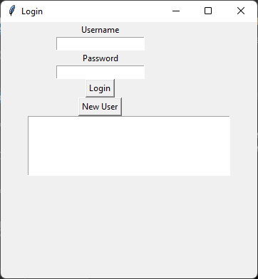

---
header-includes:
 - \usepackage{fontspec}
 - \usepackage{fvextra}
 - \setmainfont{Times New Roman}
 - \setmonofont{Consolas}
 - \fvset{breaklines=true, breakanywhere=true}
 - \renewcommand{\theFancyVerbLine}{\textcolor[rgb]{0.0,0.0,0.0}{\small\arabic{FancyVerbLine}}}
 - \DefineVerbatimEnvironment{Highlighting}{Verbatim}{commandchars=\\\{\}, frame=leftline, numbersep=4pt, framesep=4pt}
fontsize: 12pt
geometry: left=2cm,right=2cm,top=2cm,bottom=2cm
---
Name: Aum Kulkarni  
RollNo: 36  
Div: D6AD  
**Experiment5**:
```{.py include="main.py" .numberLines}
```
**Output:**
