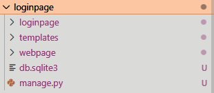

---
header-includes:
 - \usepackage{fontspec}
 - \usepackage{fvextra}
 - \setmainfont{Times New Roman}
 - \setmonofont{Consolas}
 - \fvset{breaklines=true, breakanywhere=true}
 - \renewcommand{\theFancyVerbLine}{\textcolor[rgb]{0.0,0.0,0.0}{\small\arabic{FancyVerbLine}}}
 - \DefineVerbatimEnvironment{Highlighting}{Verbatim}{commandchars=\\\{\}, frame=leftline, numbersep=4pt, framesep=4pt}
fontsize: 12pt
geometry: left=2cm,right=2cm,top=2cm,bottom=2cm
---
Name: Manas Mahajan     
RollNo: 38  
Div: D6AD  
**\Huge Experiment 9** \normalsize:    
**\Large Directory Structure** \normalsize:    
    
    
    
**\Large Views** \normalsize:    
```{.py include="loginpage/webpage/views.py" .numberLines}
```
**\Large Urls** \normalsize:
```{.py include="loginpage/loginpage/urls.py" .numberLines}
```
**\Large Templates** \normalsize:    
```{.html include="loginpage/templates/base.html" .numberLines}
```
```{.html include="loginpage/templates/home.html" .numberLines}
```
```{.html include="loginpage/templates/register.html" .numberLines}
```
```{.html include="loginpage/templates/registration/login.html" .numberLines}
```
```{.html include="loginpage/templates/registration/logged_out.html" .numberLines}
```
**Output:**    
    
     
     

    